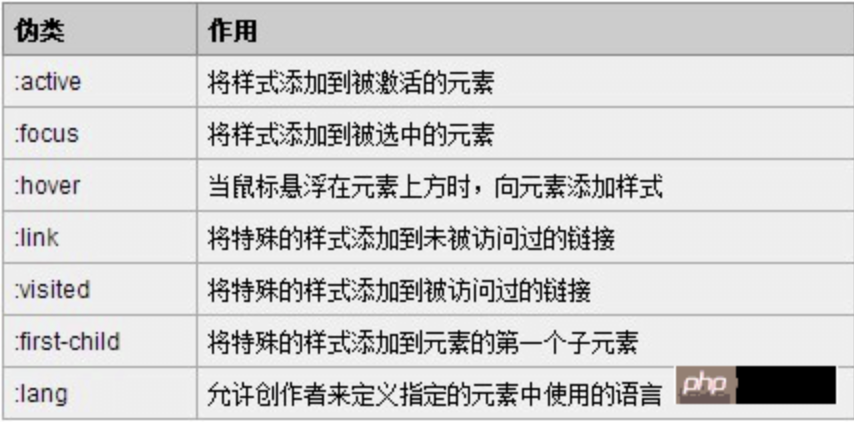

# 伪类和伪元素的区别

## 伪类

## 伪元素

## 区别

- 伪类作用对象是整个元素。例如：`a:link {color:#111}`、`a:hover{color:#222}`、`div:first-child{color:#333}`、`div:nth-child（3）{color:#444}`，尽管这些条件不是基于 DOM 的，但结果每一个都是作用于一个完整的元素，比如整个链接，段落，div 等等
- 伪元素作用于元素的一部分.`p::first-line{color:#555}`、`p::first-letter{color:#666}`、`a::before{content : "hello world";}`
- 伪元素其实相当于伪造了一个元素，例如 before,first-letter 达到的效果就是伪造了一个元素，然后添加了其相应的效果而已；
- 而伪类没有伪造元素，例如 first-child 只是给子元素添加样式而已。

伪元素和伪类之所以这么容易混淆，是因为他们的效果类似而且写法相仿，但实际上 css3 为了区分两者，已经明确规定了伪类用一个冒号来表示，而伪元素则用两个冒号来表示。
