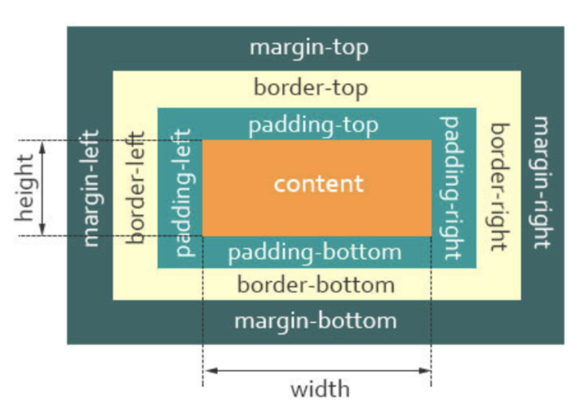
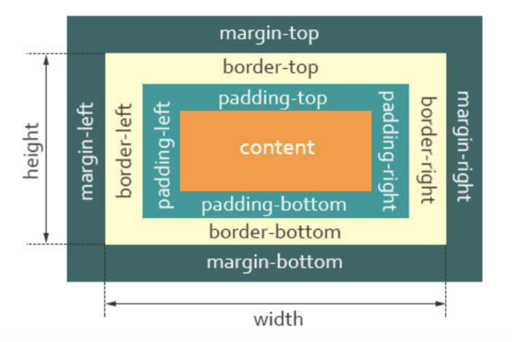

# 盒子模型

## 标准盒子模型

- 盒子总宽度 = width + padding + border + margin;
- 盒子总高度 = height + padding + border + margin
- 也就是，width/height 只是内容高度，不包含 padding 和 border 值

## IE 怪异盒子模型

- 盒子总宽度 = width + margin;
- 盒子总高度 = height + margin;
- 也就是，width/height 包含了 padding 和 border 值
