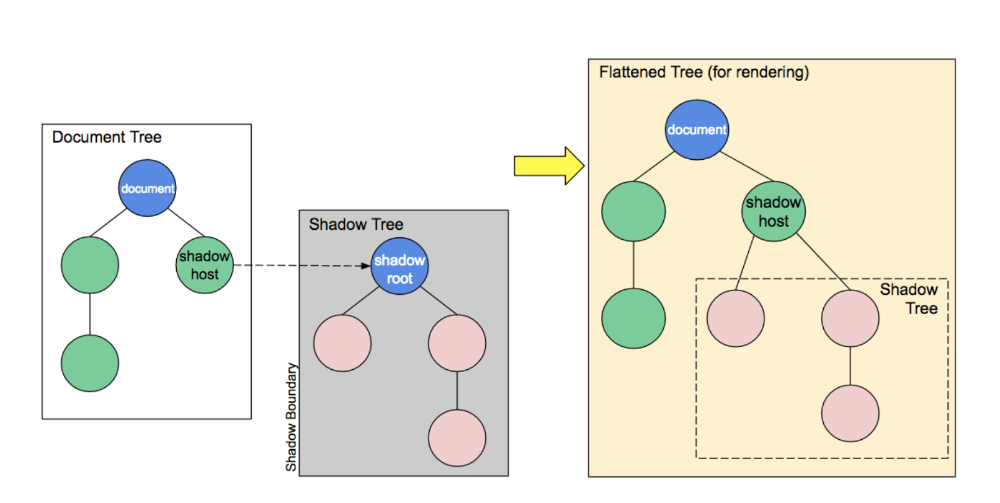

# shadow DOM

- 可以将一个隐藏的、独立的 DOM 附加到一个元素上。
- Shadow DOM 允许将隐藏的 DOM 树附加到常规的 DOM 树中——它以 shadow root 节点为起始根节点，在这个根节点的下方，可以是任意元素，和普通的 DOM 元素一样。

  

- qiankun 中的样式隔离就是基于 shadow DOM 来实现的。
- Shadow DOM 内部的元素始终不会影响到它外部的元素(除了 :focus-within)。

## shadow DOM 特有术语

- Shadow host：一个常规 DOM 节点，Shadow DOM 会被附加到这个节点上。
- Shadow tree：Shadow DOM 内部的 DOM 树。
- Shadow boundary：Shadow DOM 结束的地方，也是常规 DOM 开始的地方。
- Shadow root: Shadow tree 的根节点。

## 基本用法

`Element.attachShadow()` ：将一个 shadow root 附加到任何一个元素上；接受一个配置对象作为参数，该对象有一个 mode 属性，值可以是 open 或者 closed

```javascript
// open 表示可以通过页面内的 JavaScript 方法来获取 Shadow DOM
let shadow = elementRef.attachShadow({ mode: "open" });
// false 表示不可以从外部获取 Shadow DOM
let shadow = elementRef.attachShadow({ mode: "closed" });
```

可以使用同样的方式来操作 Shadow DOM，就和操作常规 DOM 一样,例如添加子节点、设置属性，以及为节点添加自己的样式（例如通过 element.style 属性），或者为整个 Shadow DOM 添加样式（例如在 style 元素内添加样式）
