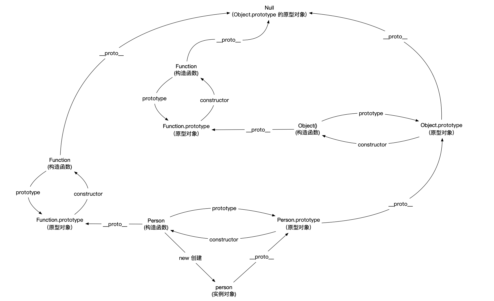
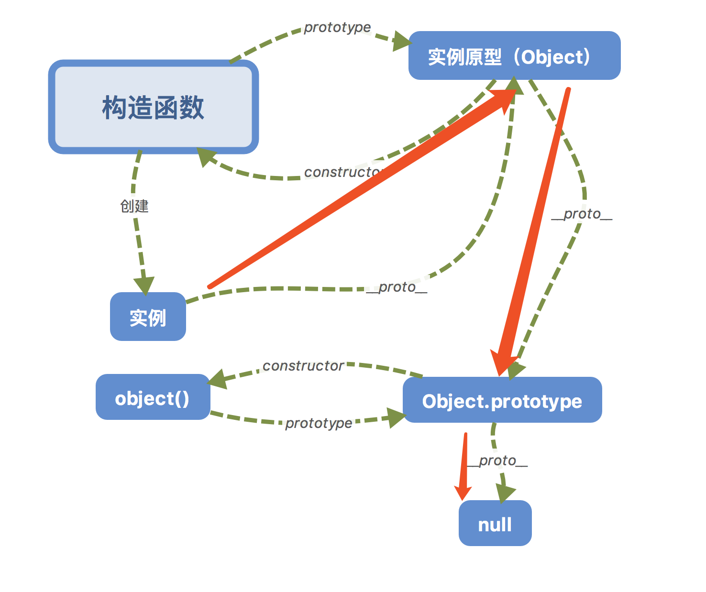

# 原型和原型链

#### 解释一下什么是原型链



**每个函数都有一个 prototype 属性（函数才拥有的属性）**，函数的 prototype 属性指向了一个对象，这个对象正是调用该构造函数而创建的实例的原型。

那什么是原型呢？**每一个 JavaScript 对象(null 除外)在创建的时候就会与之关联另一个对象，这个对象就是我们所说的原型**，每一个对象都会从原型"继承"属性。

**每一个 JavaScript 对象(除了 null )都具有的一个属性，叫**proto\*\*\*\*，这个属性会指向该对象的原型。

```javascript
function Person() {} // 构造函数
var person = new Person(); // 实例
console.log(person.__proto__ === Person.prototype); // true
```

构造函数的 prototype 以及实例的**proto**都指向实例的原型。

每个原型都有一个 constructor 属性指向关联的构造函数。

```javascript
function Person() {}
console.log(Person === Person.prototype.constructor); // true
```

原型也是一个对象，也有自己的**proto**属性，指向原型。

当读取实例的属性时，如果找不到，就会查找与对象关联的原型中的属性，如果还查不到，就去找原型的原型，一直找到最顶层为止(null)。



参考：[JavaScript 深入之从原型到原型链](https://github.com/mqyqingfeng/Blog/issues/2)

## 怎么创建一个没有原型链的对象

```javascript
Object.create(null);
```
