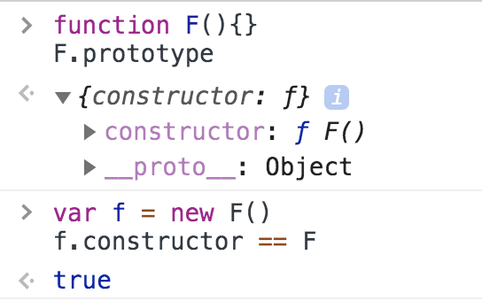

# 深浅拷贝 && 数据类型

深浅拷贝只针对引用数据类型

## JS 数据类型

- 基本数据类型：string、number、boolean、null、undefined、symbol（ES6）
- 引用数据类型：object（array、function、date、regexp）

:::tip

- 原始类型存储的是值，对象类型存储的是地址（指针），存在栈中
- 引用类型的 数据 是保存在 堆中的
- js 中对引用数据类型的操作，都是操作的对象的引用，而不是对象

:::

## symbol 在什么场景下使用

不需要对外操作和访问的属性使用 Symbol 来定义，是独一无二的值

使用场景：

- 设置私有属性，方便区分
- 替代常量
- 注册和获取全局 Symbol

请举一个平常开发过程中用到 Symbol 的例子：需要每个变量的值都是百分百不同

## 数据类型的判断

typeof、instanceof、constructor、toString

#### typeof

- 对于基本类型，除 null 以外，均可以返回正确的结果

```javascript
typeof ""; // string
typeof 1; // number
typeof true; // boolean
typeof null; // object
typeof undefined; // undefined
typeof symbol(); // symbol
```

- 对于引用类型，除 function 以外，一律返回 object 类型

```javascript
typeof []; // object
typeof new Function(); //function
typeof new Date(); // object
typeof new RegExp(); // object
```

#### instanceof

instanceof 是用来判断 A 是否为 B 的实例，表达式为：A instanceof B，如果 A 是 B 的实例，则返回 true,否则返回 false。 在这里需要特别注意的是：instanceof 检测的是**原型**

它不能检测 null 和 undefined

```javascript
[] instanceof Array; // true
({} instanceof Object); // true
(() => {}) instanceof Function; // true

// instanceof 只能用来判断两个对象是否属于实例关系， 而不能判断一个对象实例具体属于哪种类型
let arr = [];
let obj = {};
arr instanceof Array; // true
arr instanceof Object; // true
obj instanceof Object; // true
```

#### constructor

当一个函数 F 被定义时，JS 引擎会为 F 添加 prototype 原型，然后再在 prototype 上添加一个 constructor 属性，并让其指向 F 的引用。



F 利用原型对象上的 constructor 引用了自身，当 F 作为构造函数来创建对象时，原型上的 constructor 就被遗传到了新创建的对象上， 从原型链角度讲，构造函数 F 就是新对象的类型。这样做的意义是，让新对象在诞生以后，就具有可追溯的数据类型。
同样，JavaScript 中的内置对象在内部构建时也是这样做的：

```javascript
''.constructor == String // true
new Number(1).constructor == Number  // true
true.constructor == Boolean  // true
new Function().constructor == Function  // true
new Date().constructor == Date  // true
new Error().constructor == Error  // true
[].constructor == Array  // true
document.constructor == HTMLDocument  // true
window.constructor == Window  // true
```

:::tip

- null 和 undefined 是无效的对象，因此是不会有 constructor 存在的，这两种类型的数据需要通过其他方式来判断。
- 函数的 constructor 是不稳定的，这个主要体现在自定义对象上，当开发者重写 prototype 后，原有的 constructor 引用会丢失，constructor 会默认为 Object。

```javascript
function F() {}
F.prototype = { a: "*****" };
var f = new F();
f.constructor == F; // false
f.constructor; // ƒ Object()
// prototype 被重新赋值的是一个 { }， { } 是 new Object() 的字面量，
// 因此 new Object() 会将 Object 原型上的 constructor 传递给 { }，也就是 Object 本身。
```

:::

#### toString

toString() 是 Object 的原型方法，调用该方法，默认返回当前对象的 [[Class]] 。这是一个内部属性，其格式为 [object xxx] ，其中 xxx 就是对象的类型。
对于 Object 对象，直接调用 toString() 就能返回 [object Object] 。而对于其他对象，则需要通过 call / apply 来调用才能返回正确的类型信息。

```javascript
Object.prototype.toString({}); // [object Object]

Object.prototype.toString.call(""); // [object String]
Object.prototype.toString.call(1); // [object Number]
Object.prototype.toString.call(true); // [object Boolean]
Object.prototype.toString.call(Symbol()); //[object Symbol]
Object.prototype.toString.call(undefined); // [object Undefined]
Object.prototype.toString.call(null); // [object Null]
Object.prototype.toString.call(newFunction()); // [object Function]
Object.prototype.toString.call(newDate()); // [object Date]
Object.prototype.toString.call([]); // [object Array]
Object.prototype.toString.call(newRegExp()); // [object RegExp]
Object.prototype.toString.call(newError()); // [object Error]
Object.prototype.toString.call(document); // [object HTMLDocument]
Object.prototype.toString.call(window); //[object global] window 是全局对象 global 的引用
```

## 数据类型转换

#### 隐式类型转换

参考：[JavaScript 隐式类型转换，一篇就够了](https://chinese.freecodecamp.org/news/javascript-implicit-type-conversion/)

- 我们在对各种非 Number 类型运用数学运算符(- \* /)时，会先将非 Number 类型转换为 Number 类型
- 当一侧为 String 类型，被识别为字符串拼接，并会优先将另一侧转换为字符串类型；
  当一侧为 Number 类型，另一侧为原始类型，则将原始类型转换为 Number 类型；
  当一侧为 Number 类型，另一侧为引用类型，将引用类型和 Number 类型转换成字符串后拼接；

```javascript
123 + "123"; // 123123   （规则1）
123 + null; // 123    （规则2）
123 + true; // 124    （规则2）
123 + {}; // 123[object Object]    （规则3）
```

- 使用 if、while、for 时，如果只有单个变量，会先将变量转换成 Boolean 值(只有 null undefined '' NaN 0 false 这几个是 false，其他的情况都是 true，比如 {} , [])
- ==的规则：

  1）NaN 和其他任何类型比较永远返回 false（包括和他自己 ）

```javascript
NaN == NaN; // false
```

2）Boolean 和其他任何类型比较，Boolean 首先被转换为 Number 类型

```javascript
true == "2"; // false, 先把 true 变成 1
```

3）String 和 Number 比较，先将 String 转换为 Number 类型

```javascript
123 == "123"; // true, '123' 会先变成 123
```

4）**null == undefined 比较结果是 true**，除此之外，null、undefined 和其他任何结果的比较值都为 false

```javascript
null == undefined; // true
```

5）原始类型和引用类型做比较时，引用类型会依照 ToPrimitive 规则转换为原始类型

```javascript
"1,2,3" == [1, 2, 3]; // true, [1, 2, 3]通过 toString 得到一个基本类型值
```

#### 强制类型转换

- 转换成 Number 类型方法：Number()、parseFloat() 、 parseInt()

```javascript
Number(null); // 0
Number(false); // 0
Number(true); // 1
Number(undefined); // NaN
Number([]); // 0
Number("324abc"); // NaN
parseInt("324abc"); // 324
parseFloat("324abc"); // 324
```

- 转换成 String 类型方法：String()、 toString() (undefined 和 null 没有 toString()方法)

```javascript
String(123); // "123"
String("abc"); // "abc"
String(1e21); // '1e+21'
String(true); // "true"
String(undefined); // "undefined"
String(null); // "null"
String([]); // ''
String([1, 2, 3]); // "1,2,3"

true.toString(); // 'true'
(1.23).toString(); //'1.23'
NaN.toString(); //'NaN'
Infinity.toString(); //'Infinity'

17.toString(); // 报错:Uncaught SyntaxError: Invalid or unexpected token
(17).toString(); // '17'
```

- 转换成 Boolean 类型方法：Boolean()

```javascript
Boolean(undefined); // false
Boolean(null); // false
Boolean(0); // false
Boolean(NaN); // false
Boolean(""); // false
Boolean(true); // true
Boolean(false); // false
Boolean({}); // true
Boolean([]); // true
```

## 浅拷贝

浅拷贝是创建一个新的对象，这个对象有原始对象的值的一份精确的拷贝

- 基本类型：拷贝的就是基本类型的值
- 引用类型：拷贝的是内存的地址，也就是栈内存的对象的指针。如果一个对象改变了这个地址，就会影响其他对象

#### 浅拷贝的实现方式

- Object.assign()
- 函数库 lodash 的\_.clone 方法
- 展开运算符...
- Array.prototype.concat()
- Array.prototype.slice()

## 深拷贝

深拷贝是将一个对象从内存中完整的拷贝一份出来,从堆内存中开辟一个新的区域存放新对象,且**修改新对象不会影响原对象**。

#### 深拷贝的实现方式

- JSON.parse(JSON.stringify())
- 函数库 lodash 的\_.cloneDeep 方法
- jQuery.extend()方法
- 手写递归方法: 遍历对象、数组直到里边都是基本数据类型，然后再去复制，就是深度拷贝。

```javascript
function deepClone(obj, hash = new WeakMap()) {
  if (obj === null) return obj; // 如果是null或者undefined我就不进行拷贝操作
  if (obj instanceof Date) return new Date(obj);
  if (obj instanceof RegExp) return new RegExp(obj);
  // 可能是对象或者普通的值  如果是函数的话是不需要深拷贝
  if (typeof obj !== "object") return obj;
  // 是对象的话就要进行深拷贝
  if (hash.get(obj)) return hash.get(obj);
  let cloneObj = new obj.constructor();
  // 找到的是所属类原型上的constructor,而原型上的 constructor指向的是当前类本身
  hash.set(obj, cloneObj);
  for (let key in obj) {
    if (obj.hasOwnProperty(key)) {
      // 实现一个递归拷贝
      cloneObj[key] = deepClone(obj[key], hash);
    }
  }
  return cloneObj;
}
let obj = { name: 1, address: { x: 100 } };
obj.o = obj; // 对象存在循环引用的情况
let d = deepClone(obj);
obj.address.x = 200;
console.log(d);
```

#### 参考

[浅拷贝与深拷贝](https://juejin.cn/post/6844904197595332622)

[如何写出一个惊艳面试官的深拷贝?](https://segmentfault.com/a/1190000020255831)
