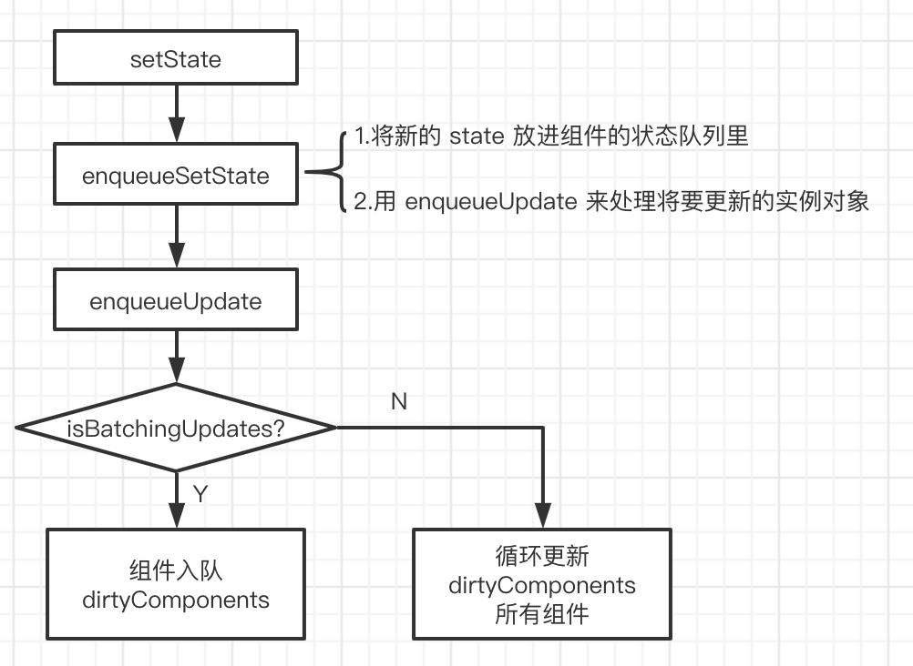

# setState

## setState 是同步还是异步？

> setState 本身并不是异步，只是因为 react 的性能优化机制体现为异步。在 react 的生命周期函数或者合成事件下为异步，在 DOM 原生事件下以及 setTimeOut 为同步。

#### 为什么在 react 的生命周期函数或者作用域下为异步?

在 state 中定义一个值，在 componentDidMount 中 setState 改变这个值，如：

```javascript
  constructor(props) {
    super(props);
    this.state = {
      number: 1,
    };
  }
  componentDidMount() {
    this.setState({ number: 3 });
    console.log(this.state.number);  // 1
  }
```

此时的打印结果为 1，从表象上看，像是异步的操作， 但其实只是异步的表现形式，每次调用 setState 都会触发更新，异步操作是为了提高性能，将多个状态合并一起更新，减少重新 render 的次数。如果在一个循环中 setState，在同步机制下，就会重复渲染，消耗性能，所以 react 会将多个 setState 合并为一个执行，当执行 setState 时，state 中的数据不会立马更新。

```javascript
for (let i = 0; i < 100; i++) {
  this.setState({ number: this.state.number + 1 });
  console.log(this.state.number);
}
```

打印结果：


#### 如何同步的获取到更新后的数据？

通过回调函数

```javascript
this.setState({ number: 3 }, () => {
  console.log(this.state.number); // 3
});
```

#### 为什么 setTimeout 可以将 setState 的执行顺序从异步变为同步？

```javascript
setTimeout(() => {
  this.setState({ number: 3 });
  console.log(this.state.number); // 3
}, 0);
```

并不是 setTimeout 改变了 setState，而是 setTimeout 帮助 setState “逃脱”了 React 对它的管控。只要是在 React 管控下的 setState，一定是异步的。

setState 工作流为：



isBatchingUpdates 是一个 react 全局唯一的变量，初始值是 false，意味着“当前并未进行任何批量更新操作”，每当 React 去执行更新动作时，会将 isBatchingUpdates 置为 true，表示现在正处于批量更新过程中。置为 true 时，任何需要更新的组件都只能暂时进入 dirtyComponents 里排队等候下一次的批量更新。
isBatchingUpdates 这个变量，在 React 的生命周期函数以及合成事件执行前，已经被 React 悄悄修改为了 true，这时我们所做的 setState 操作自然不会立即生效。当函数执行完毕后，事务的 close 方法会再把 isBatchingUpdates 改为 false。
因为 isBatchingUpdates 是在同步代码中变化的，而 setTimeout 的逻辑是异步执行的。当 this.setState 调用真正发生的时候，isBatchingUpdates 早已经被重置为了 false，这就使得当前场景下的 setState 具备了立刻发起同步更新的能力。

#### 为什么在原生 DOM 操作中也是同步的？

原生 js 绑定的事件，不受 react 的控制，isBatchingUpdates 不设置为 true。

## 调用 setstate 之后发生了什么？

在代码中调用 setState 函数之后，React 会将传入的参数对象与组件当前的状态合并，然后触发所谓的调和过程（Reconciliation）。经过调和过程，React 会以相对高效的方式根据新的状态构建 React 元素树并且着手重新渲染整个 UI 界面。在 React 得到元素树之后，React 会自动计算出新的树与老树的节点差异，然后根据差异对界面进行最小化重渲染。在差异计算算法中，React 能够相对精确地知道哪些位置发生了改变以及应该如何改变，这就保证了按需更新，而不是全部重新渲染。


