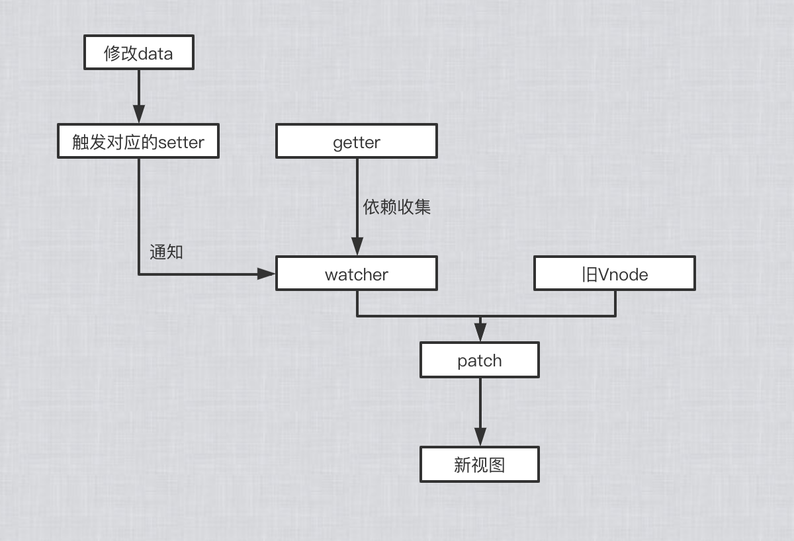

# 从修改 data 里的数据到视图更新的过程

在修改一个对象值的时候，会通过 setter -> Watcher -> update 的流程来修改对应的视图

在修改对象的值的时候，会触发对应的 setter， setter 通知之前 getter 依赖收集得到的 Dep 中的每一个 Watcher，告诉它们自己的值改变了，需要重新渲染视图。这时候这些 Watcher 就会开始调用 update，新的 VNode 节点与旧的 VNode 节点进行 patch， 来更新视图

