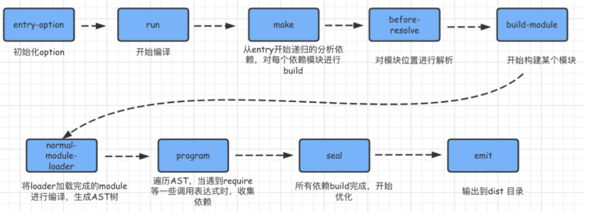

# webpack 的构建流程

webpack 的运行流程是一个串行的过程，它的工作流程就是将各个插件串联起来

从启动到结束会依次执行以下三大步骤：

- 初始化流程：从配置文件和 Shell 语句中读取与合并参数，并初始化需要使用的插件和配置插件等执行环境所需要的参数
- 编译构建流程：从 Entry 发出，针对每个 Module 串行调用对应的 Loader 去翻译文件内容，再找到该 Module 依赖的 Module，递归地进行编译处理
- 输出流程：对编译后的 Module 组合成 Chunk，把 Chunk 转换成文件，输出到文件系统

[webpack 构建流程](https://vue3js.cn/interview/webpack/build_process.html#%E4%B8%80%E3%80%81%E8%BF%90%E8%A1%8C%E6%B5%81%E7%A8%8B)
