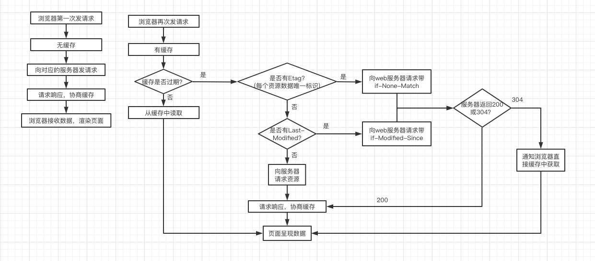

# 强缓存和协商缓存

## 强缓存

不会向服务器发送请求，直接从缓存中读取资源，在 chrome 控制台的 network 选项中可以看到该请求返回 200 的状态码;

## 协商缓存

向服务器发送请求，服务器会根据这个请求的 request header 的一些参数来判断是否命中协商缓存，如果命中，则返回 304 状态码并带上新的 response header 通知浏览器从缓存中读取资源；

两者的共同点是，都是从客户端缓存中读取资源；区别是强缓存不会发请求，协商缓存会发请求。
