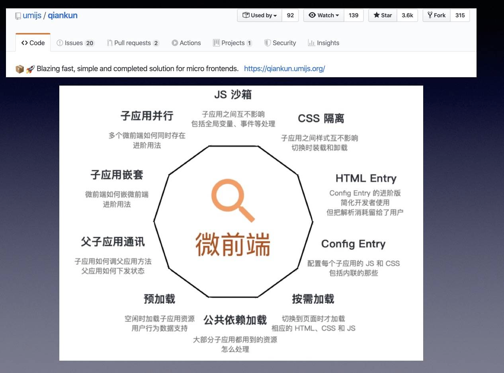

# 标准签-微前端（qiankun）

[标准签对接 qiankun](https://www.notion.so/qiankun-1110c4ff6f5244709dcc18b9f289c923)

[qiankun 原理简述](https://mp.weixin.qq.com/s/EG0ybc5hLgUzHoNvIPapFw)

## 什么是微前端

> 微前端是一种多个团队通过独立发布功能的方式来共同构建现代化 web 应用的技术手段及方法策略。

## 微前端的特点

- **技术栈无关**： 主框架不限制接入应用的技术栈，微应用具备完全自主权
- **独立开发、独立部署**： 微应用仓库独立，前后端可独立开发，部署完成后主框架自动完成同步更新
- **增量升级**： 在面对各种复杂场景时，我们通常很难对一个已经存在的系统做全量的技术栈升级或重构，而微前端是一种非常好的实施渐进式重构的手段和策略
- **独立运行时**： 每个微应用之间状态隔离，运行时状态不共享

## 微前端的缺点

- 需要在开发中运行许多不同的应用程序以测试完成的体验
- 跟踪和调试问题需要跨全部系统

## 为什么不用 iframe 实现

- url 不同步。浏览器刷新 iframe url 状态丢失、后退前进按钮无法使用。
- UI 不同步，DOM 结构不共享。想象一下屏幕右下角 1/4 的 iframe 里来一个带遮罩层的弹框，同时我们要求这个弹框要浏览器居中显示，还要浏览器 resize 时自动居中..
- 全局上下文完全隔离，内存变量不共享。iframe 内外系统的通信、数据同步等需求，主应用的 cookie 要透传到根域名都不同的子应用中实现免登效果。
- 慢。每次子应用进入都是一次浏览器上下文重建、资源重新加载的过程。

## 实现原理 - 应用隔离

基于`window.Proxy` 实现 `genSandbox`

- LegacySandbox
- 多实例沙箱 - ProxySandbox （使用 window.proxy（pu，热，ke，sei））
- IE 下使用 SnapshotSandbox （diff）

## 实现原理 - 应用通讯

[基于 qiankun 的微前端最佳实践（图文并茂） - 应用间通信篇](https://juejin.cn/post/6844904151231496200)

`qiankun` 内部提供了 `initGlobalState` 方法用于注册 `MicroAppStateActions` 实例用于通信，该实例有三个方法，分别是：

- `setGlobalState`：设置 `globalState` - 设置新的值时，内部将执行 `浅检查`，如果检查到 `globalState` 发生改变则触发通知，通知到所有的 `观察者` 函数。
- `onGlobalStateChange`：注册 `观察者` 函数 - 响应 `globalState` 变化，在 `globalState` 发生改变时触发该 `观察者` 函数。
- `offGlobalStateChange`：取消 `观察者` 函数 - 该实例不再响应 `globalState` 变化。

## 实现原理 - 样式隔离

- runtime css transformer（严格模式：Shadow DOM）

## 实现原理 - js 隔离

qiankun 的隔离方式有两种：

- 基于 proxy 对全局 window 生成一个代理对象
- 通过快照沙箱在沙箱挂载和卸载的时候记录快照，在应用切换的时候依据快照恢复环境。

qiankun 则是根据当前环境是否存在 proxy 来判断他的隔离方式。
